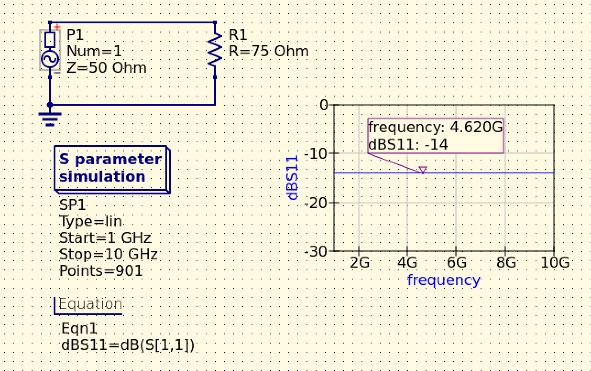

# 001 反射係数とS11

## 目的
反射係数について、理論計算とシミュレーション結果を比較しながら理解を深める。

## 理論
反射係数 $\Gamma$ は、入射波に対する反射波の比である。
入射波は信号源から負荷へ向かう波、反射波は負荷側で反射して信号源側へ戻る波を指す。

伝送線路の特性インピーダンスを $Z_0$、負荷インピーダンスを $Z_L$ とすると、反射係数 $\Gamma$ は以下のように表される。

$$
\Gamma = \frac{Z_L - Z_0}{Z_L + Z_0}
$$

$S_{11}$ は、ポート1に入射した波に対してポート1へ反射して戻る波の比である。
入射波の複素振幅を $a$、反射波の複素振幅を $b$ とすると、$S_{11}$ は以下のように表される。

$$
S_{11} = \frac{b}{a}
$$

1ポート回路では、$S_{11}$ は反射係数 $\Gamma$ と一致する。

参考文献
https://www.wti.jp/contents/ts-blog/210721.htm

## 手計算
特性インピーダンス $Z_0 = 50\,\Omega$ の伝送線路に、$Z_L = 75\,\Omega$ の負荷を接続したとき、反射係数は以下のように求まる。

$$
\Gamma = \frac{Z_L - Z_0}{Z_L + Z_0}
       = \frac{75 - 50}{75 + 50}
       = 0.2
$$

dB表示に変換すると、以下のようになる。

$$
20 \log_{10} |\Gamma|
= 20 \log_{10} 0.2
= -13.98\,\mathrm{dB}
$$

## Qucs-Sでの確認

シミュレーション結果では、$S_{11} \simeq -14\,\mathrm{dB}$ となった。

## 結果比較
手計算では $-13.98\,\mathrm{dB}$、Qucs-S のシミュレーションでは約 $-14\,\mathrm{dB}$ となった。
したがって、理論計算とシミュレーション結果はほぼ一致した。

## 気づき
負荷インピーダンスが特性インピーダンスと一致しない場合、接続点で反射が発生することを確認できた。
今回の例では $Z_L = 75\,\Omega$、$Z_0 = 50\,\Omega$ のため、反射係数は $0.2$ となり、$S_{11}$ は約 $-14\,\mathrm{dB}$ になった。
