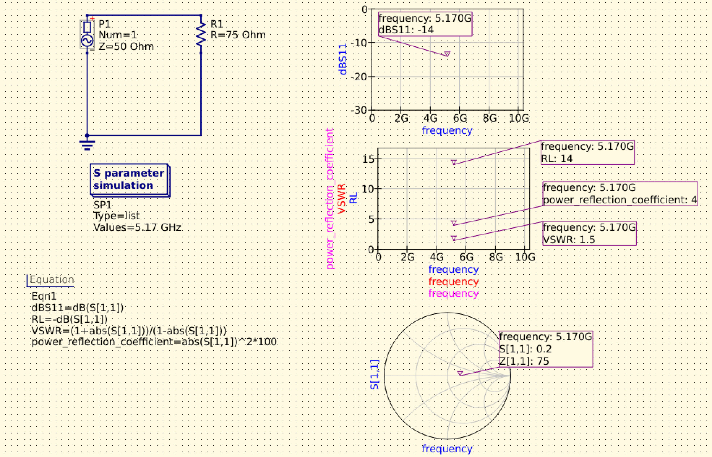
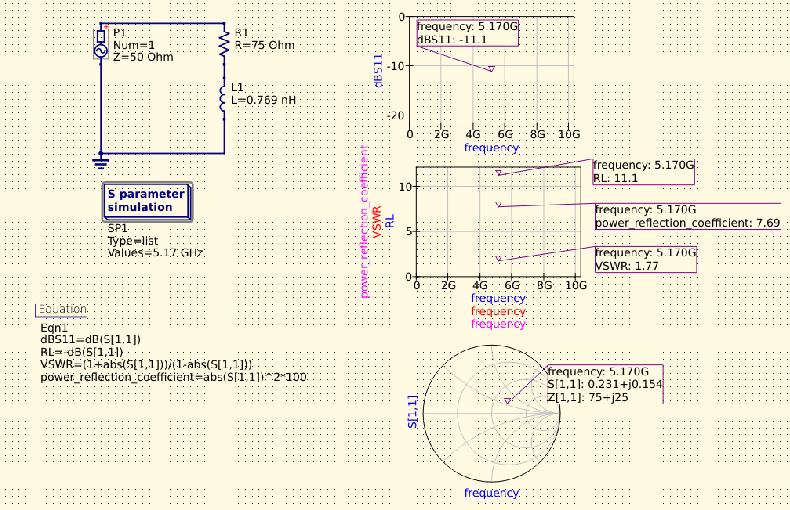

# 002 リターンロスとVSWR

## 目的
反射係数から、リターンロスとVSWRを計算し、S11 の dB 表示が何を意味しているか理解する。

$$
\Gamma
$$

$$
S_{11}
$$

## 理論
- リターンロス RL: 入射電力に対して、反射電力がどれだけ小さいかを表す量。

入射電力と反射電力を以下のようにおく。

$$
P_\mathrm{in}
$$

$$
P_\mathrm{ref}
$$

リターンロスを電力比で表すと、以下のようになる。

$$
RL_\mathrm{ratio} = \frac{P_\mathrm{in}}{P_\mathrm{ref}}
$$

通常は dB 表示で扱う。反射係数を用いると以下のようになる。

$$
RL = -20 \log_{10} |\Gamma|
$$

リターンロスは値が大きいほど反射が小さく、効率的に電力伝送できていることを表す。

- VSWR: 進行波と反射波の干渉によって起こる定在波の最大電圧と最小電圧の比を取った値。

$$
VSWR = \frac{P_\mathrm{in}}{P_\mathrm{ref}}
$$

反射係数を用いると、以下の計算式となる。

$$
VSWR = \frac{1 + |\Gamma|}{1 - |\Gamma|}
$$

完全に整合が取れている場合は以下となる。

$$
VSWR = 1
$$

- 反射電力比: 入射電力に対する反射電力の割合。

$$
\frac{P_\mathrm{ref}}{P_\mathrm{in}} = |\Gamma|^2
$$

参考文献
https://www.rohde-schwarz.com/jp/products/test-and-measurement/essentials-test-equipment/spectrum-analyzers/voltage-standing-wave-ratio-vswr-and-return-loss_258140.html

## 手計算
まず、純抵抗負荷の例を計算する。

$$
Z_0 = 50\,\Omega
$$

$$
Z_L = 75\,\Omega
$$

反射係数は以下となる。

$$
\Gamma = \frac{Z_L - Z_0}{Z_L + Z_0}
       = \frac{75 - 50}{75 + 50}
       = 0.2
$$

S11 の dB 表示は以下となる。

$$
S_{11}[\mathrm{dB}] = 20 \log_{10} |\Gamma|
                    = 20 \log_{10} 0.2
                    \simeq -13.98\,\mathrm{dB}
$$

リターンロスは以下となる。

$$
RL = -20 \log_{10} |\Gamma|
   \simeq 13.98\,\mathrm{dB}
$$

反射電力比は以下となる。

$$
|\Gamma|^2 = 0.2^2
           = 0.04
           = 4\%
$$

VSWRは以下となる。

$$
VSWR = \frac{1 + |\Gamma|}{1 - |\Gamma|}
     = \frac{1 + 0.2}{1 - 0.2}
     = 1.5
$$

次に、複素負荷の例を計算する。

$$
Z_0 = 50\,\Omega
$$

$$
Z_L = 75 + 25j\,\Omega
$$

反射係数は以下となる。

$$
\Gamma = \frac{Z_L - Z_0}{Z_L + Z_0}
       = \frac{75+25j - 50}{75+25j + 50}
       = \frac{25+25j}{125+25j}
       = \frac{3+2j}{13}
       \simeq 0.231 + 0.154j
$$

反射係数の大きさは以下となる。

$$
|\Gamma| = \sqrt{0.231^2 + 0.154^2}
          = \frac{1}{\sqrt{13}}
          \simeq 0.277
$$

S11 の dB 表示は以下となる。

$$
S_{11}[\mathrm{dB}] = 20 \log_{10} |\Gamma|
                    = 20 \log_{10}\left(\frac{1}{\sqrt{13}}\right)
                    \simeq -11.14\,\mathrm{dB}
$$

リターンロスは以下となる。

$$
RL = -20 \log_{10} |\Gamma|
   \simeq 11.14\,\mathrm{dB}
$$

反射電力比は以下となる。

$$
|\Gamma|^2 = \left(\frac{1}{\sqrt{13}}\right)^2
           = \frac{1}{13}
           \simeq 0.077
           = 7.7\%
$$

VSWRは以下となる。

$$
VSWR = \frac{1 + |\Gamma|}{1 - |\Gamma|}
     = \frac{1 + 1/\sqrt{13}}{1 - 1/\sqrt{13}}
     \simeq 1.77
$$

## Qucs-Sでの確認
Qucs-S では以下の式を定義し、S11 の dB 値、リターンロス、VSWR、反射電力比を確認した。

```text
dBS11 = dB(S[1,1])
RL = -dB(S[1,1])
VSWR = (1+abs(S[1,1]))/(1-abs(S[1,1]))
PowerReflectionCoefficient = abs(S[1,1])^2
```

以下は純抵抗負荷の場合の結果である。

$$
Z_L = 75\,\Omega
$$



$$
\Gamma = 0.2
$$

$$
S_{11}[\mathrm{dB}] \simeq -14\,\mathrm{dB}
$$

$$
RL \simeq 14\,\mathrm{dB}
$$

$$
|\Gamma|^2 = 4\%
$$

$$
VSWR = 1.5
$$

以下は複素負荷の場合の結果である。

$$
Z_L = 75 + 25j\,\Omega
$$

75Ω抵抗にインダクタを直列接続し、5.17GHz時点でシミュレーションした。

$$
L = 0.679\,\mathrm{nH}
$$



$$
\Gamma \simeq 0.231 + 0.154j
$$

$$
S_{11}[\mathrm{dB}] \simeq -11.1\,\mathrm{dB}
$$

$$
RL \simeq 11.1\,\mathrm{dB}
$$

$$
|\Gamma|^2 \simeq 7.69\%
$$

$$
VSWR \simeq 1.77
$$

## 気づき
シミュレーションと手計算の値がほぼ一致する結果となった。

純抵抗負荷の場合、S11は以下となった。

$$
Z_0 = 50\,\Omega
$$

$$
Z_L = 75\,\Omega
$$

$$
S_{11}[\mathrm{dB}] \simeq -14\,\mathrm{dB}
$$

このとき、反射係数の大きさと反射電力比は以下となる。

$$
|\Gamma| = 0.2
$$

$$
|\Gamma|^2 = 0.04 = 4\%
$$

複素負荷の場合、S11は以下となった。

$$
Z_0 = 50\,\Omega
$$

$$
Z_L = 75 + 25j\,\Omega
$$

$$
S_{11}[\mathrm{dB}] \simeq -11.1\,\mathrm{dB}
$$

このとき、反射係数と反射電力比は以下となる。

$$
\Gamma \simeq 0.231 + 0.154j
$$

$$
|\Gamma|^2 \simeq 7.7\%
$$

VSWRを比較すると、複素負荷の方が大きい結果となった。

$$
VSWR_{75\,\Omega} = 1.5
$$

$$
VSWR_{75+25j\,\Omega} = 1.77
$$

よって、複素負荷の方が反射が大きく、電力伝送の効率が低いと考えられる。
