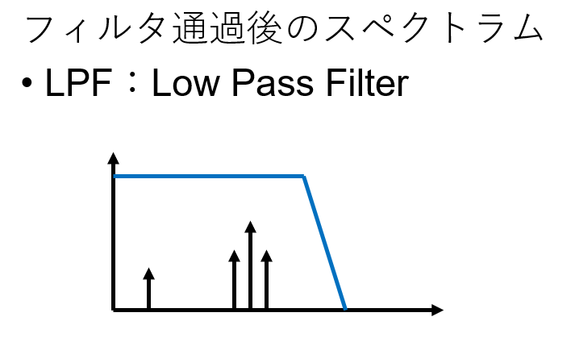
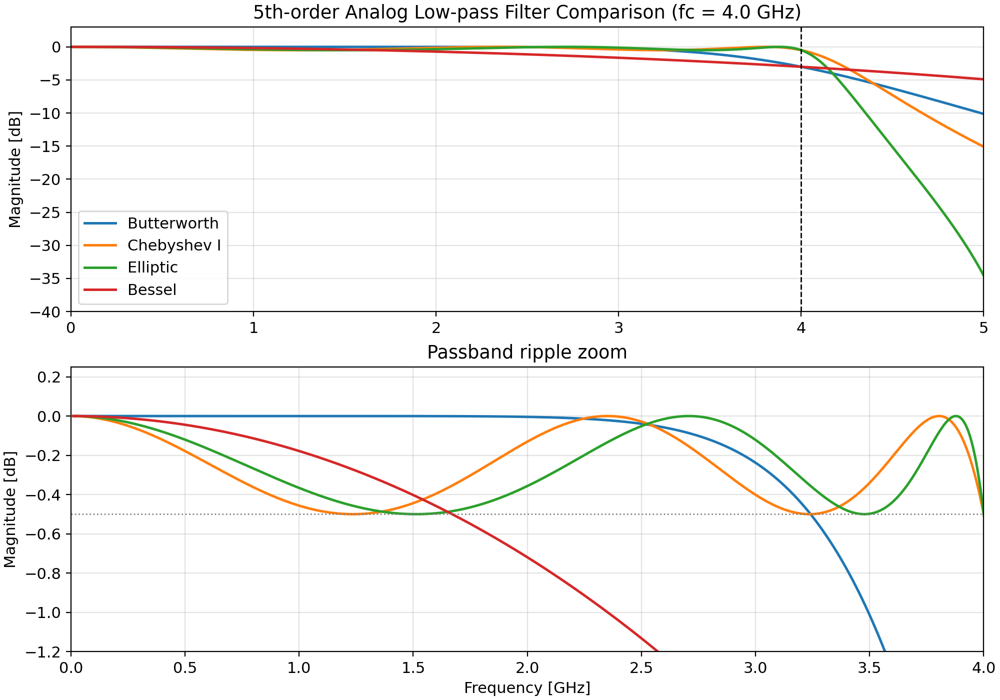
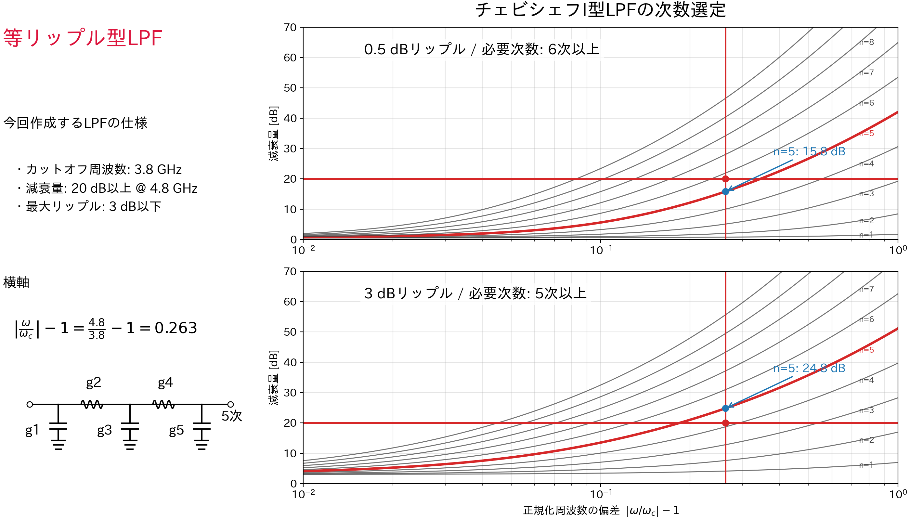

# 2026-03-10

## Today
LPF1

## Issues
-フィルタとは：入力信号から必要な周波数成分を取りだす部品

LPF：遮断周波数から低域の周波数成分を取りだすフィルタ

-LPFで重要となる指標
・通過帯域幅(-3dB)
・遮断特性(減衰量)
・通過帯域リップル
・群遅延特性

-今回採用したLPF
：チェビシェフ型LPF 
→通過帯域にリップルはあるが，同次のベッセル・バタワース型より急峻な遮断特性

-次数の決定
次数が多い程遮断特性がよくなる
→遮断周波数からの減衰量から次数を決定．
遮断周波数ωc=4 GHz,　減衰量20 dB(@ω=5GHz)
最大リップル:-3dB
正規化周波数からの偏差
|ω/ωc|-1=5/4-1=0.25

このグラフは横軸が正規化周波数の偏差|ω/ωc|-1，縦軸が減衰量(dB)を示している．
最大リップルが-3dBの場合のグラフに注目する．
|ω/ωc|-1=0.25のとき
4次：減衰量=－-20dB以下
5次：減衰量=-25dBである．

設計仕様の5GHzで減衰量-20dBを満たすため，
5次のフィルタを採用する．

## Next
フィルタのLC定数の決定から再開

