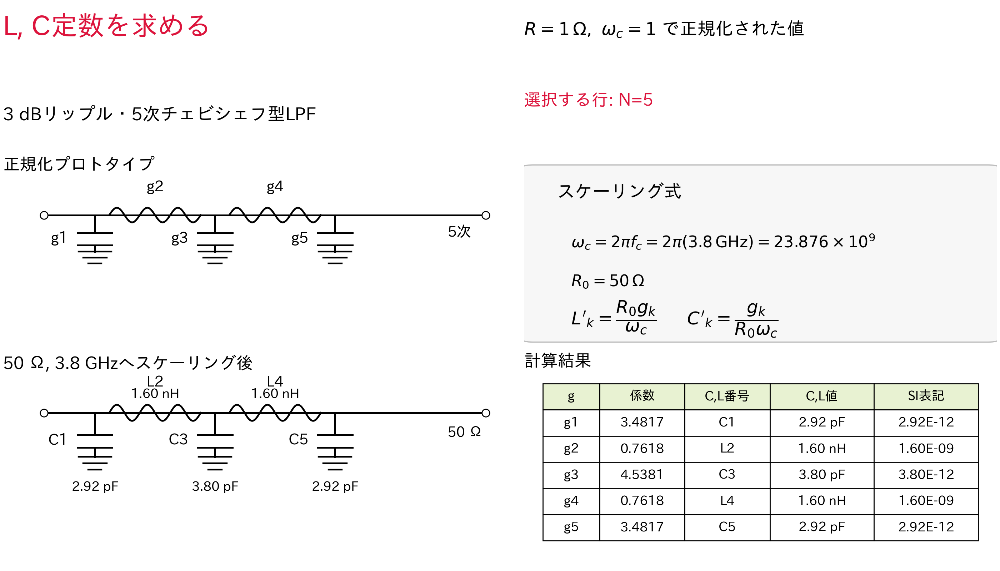
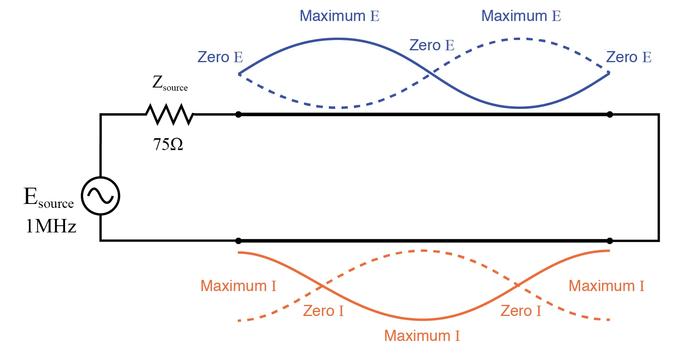
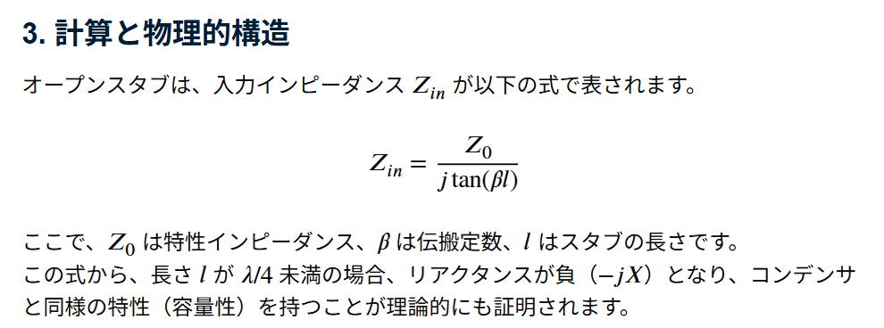

# 2026-03-10

## Today
LPFその2

## Issues
チェビシェフ型LPFのLC定数の決定方法

| g  | 係数   | C,L番号 | C,L値     |
|----|--------|---------|-----------|
| g1 | 3.4817 | C1      | 2.92E-12  |
| g2 | 0.7618 | L2      | 1.60E-09  |
| g3 | 4.5381 | C3      | 3.80E-12  |
| g4 | 0.7618 | L4      | 1.60E-09  |
| g5 | 3.4817 | C5      | 2.92E-12  |

表の係数は正規化されているのでスケーリングする。

カットオフ角周波数は $\omega_c = 2\pi f_c$ で与えられる。

$$
\omega_c = 2\pi f_c = 2\pi (3.8\,\mathrm{GHz}) = 23.876 \times 10^9
$$

$$
R_0 = 50\,\Omega
$$

$$
L'_k = \frac{R_0 L_k}{\omega_c}
$$

$$
C'_k = \frac{C_k}{R_0 \omega_c}
$$

計算
$$
C'_k = \frac{C_1}{R_0 \omega_c} = \frac{3.4817}{50 \times 2\pi \times 3.81\times 10^9}=2.91 pF
$$

λ/4共振が起きる物理的理由

反射して帰ってきたとき180度回転するから

オープンスタブがCの理由

## Next

